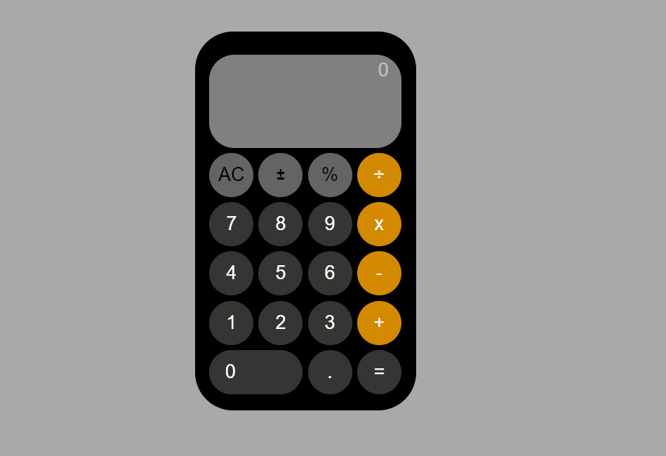

# Project : Ios Calculator App

## Check The Live Website ➡️ [Live Website](https://iphone-hesap-makinesi-mirayengin.vercel.app/)

## Visualization of the Website

## Learning Outcomes

At the end of the this project, you will be able to;

- analyze a problem,

- demonstrate your knowledge of algorithmic design principles,

## Project Skeleton 

|----Ios Calculator App

        |----index.html  
        |----index.css   
        |----calc.js
        |----calculator.gif
        |----readme.md 

### Overview
I mastered HTML, CSS and Javascript features in this project. You can see the visual representation of the website above.